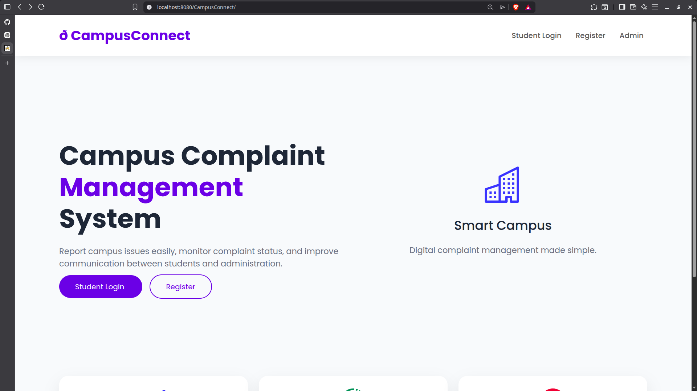
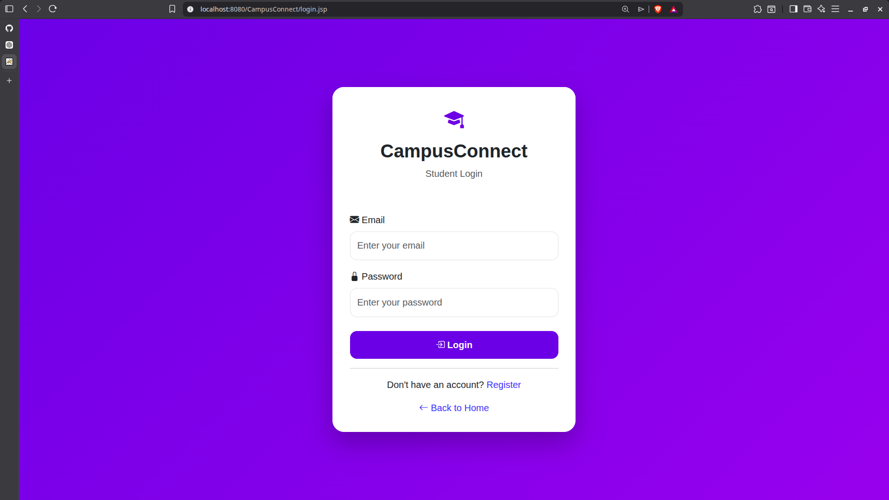
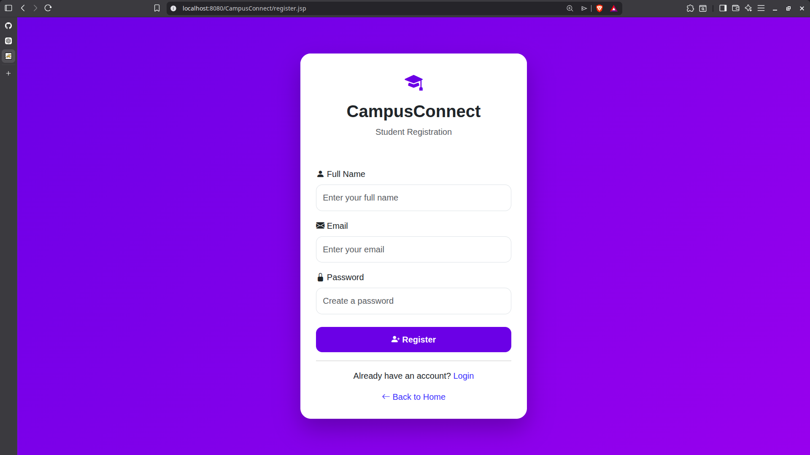
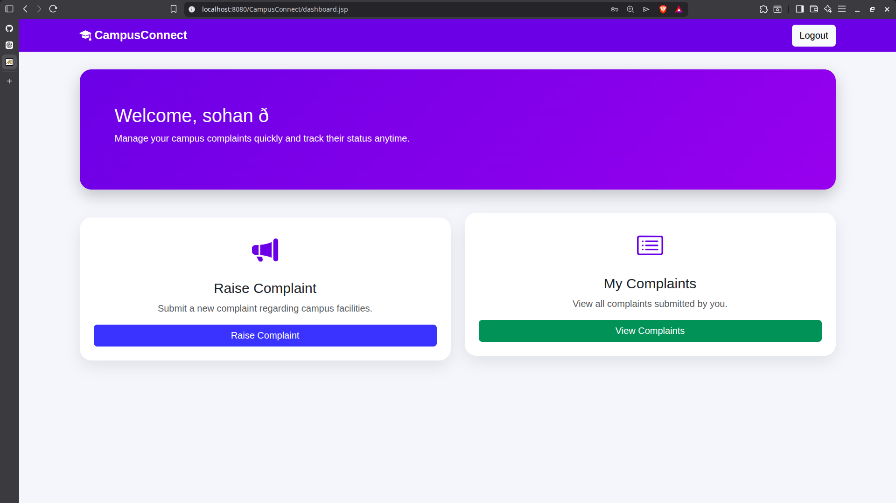
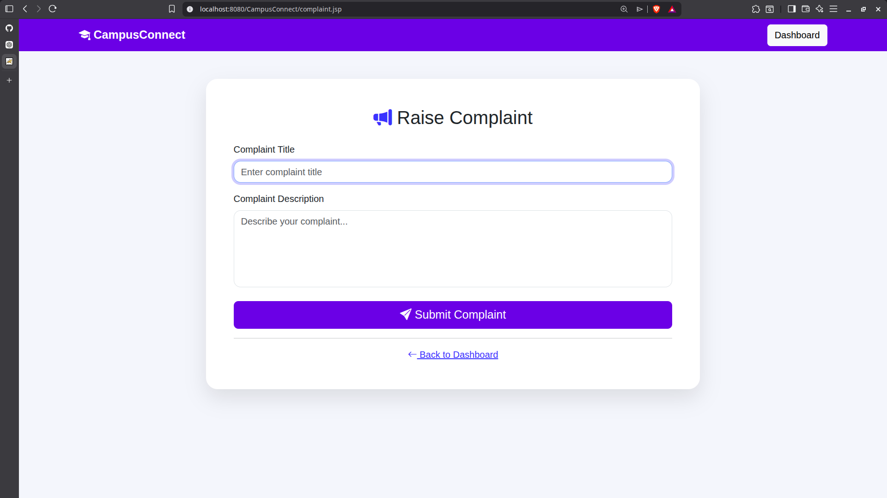
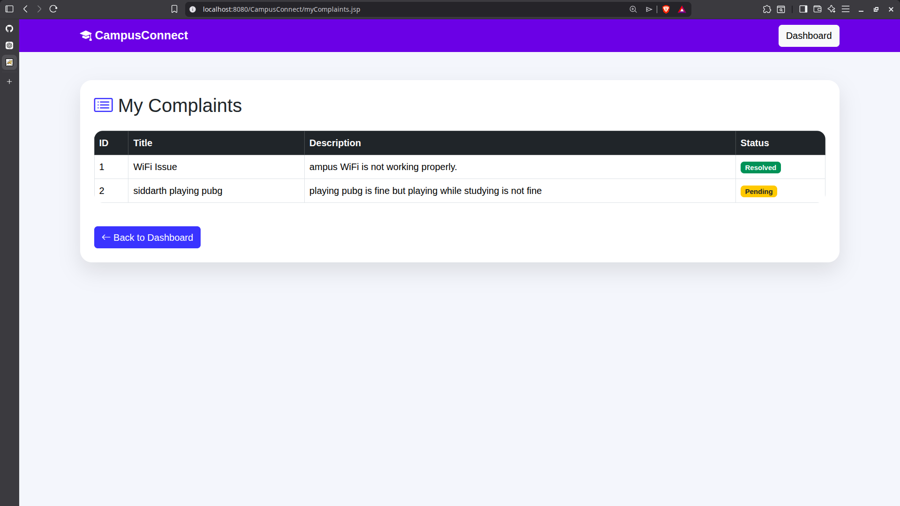
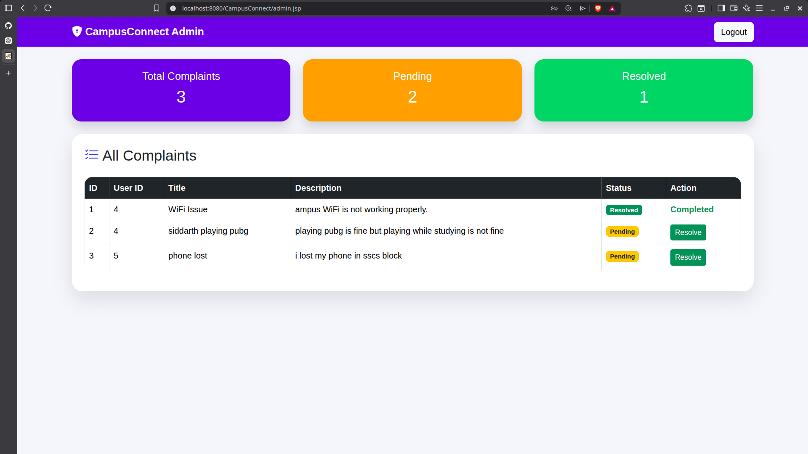

# 🎓 CampusConnect

> A modern **Student Complaint Management System** developed using **Java, JSP, Servlets, JDBC, MySQL, Maven, Apache Tomcat, HTML, CSS, and Bootstrap**.

CampusConnect provides a simple platform where students can register, submit complaints, monitor their complaint status, and administrators can efficiently manage and resolve complaints.

---

## 📌 Project Overview

Managing campus complaints manually can be time-consuming and inefficient. CampusConnect digitizes the complaint management process by allowing students to submit complaints online while providing administrators with a centralized dashboard to manage and resolve them.

---

# ✨ Features

## 👨‍🎓 Student Module

- ✅ Student Registration
- ✅ Student Login
- ✅ Raise New Complaint
- ✅ View Submitted Complaints
- ✅ Track Complaint Status
- ✅ Logout

---

## 👨‍💼 Administrator Module

- ✅ Administrator Login
- ✅ View All Complaints
- ✅ Resolve Student Complaints
- ✅ Complaint Statistics Dashboard
- ✅ Logout

---

# 🛠️ Technology Stack

| Technology | Purpose |
|------------|---------|
| Java | Backend Development |
| JSP | Frontend Pages |
| Servlets | Business Logic |
| JDBC | Database Connectivity |
| MySQL | Database |
| Apache Tomcat | Web Server |
| Maven | Build Tool |
| Bootstrap 5 | UI Framework |
| HTML5 | Structure |
| CSS3 | Styling |

---

# 🏗️ Project Architecture

```
             Student
                 │
                 ▼
             JSP Pages
                 │
                 ▼
            Java Servlets
                 │
                 ▼
              DAO Layer
                 │
                 ▼
             MySQL Database
```

---

# 📂 Project Structure

```
CampusConnect
│
├── src
│   └── main
│       ├── java
│       │   ├── controller
│       │   ├── dao
│       │   └── model
│       │
│       └── webapp
│           ├── css
│           ├── images
│           ├── WEB-INF
│           ├── index.jsp
│           ├── login.jsp
│           ├── register.jsp
│           ├── dashboard.jsp
│           ├── complaint.jsp
│           ├── myComplaints.jsp
│           └── admin.jsp
│
├── screenshots
├── pom.xml
└── README.md
```

---

# 📸 Project Screenshots

## 🏠 Home Page



---

## 🔐 Student Login



---

## 📝 Student Registration



---

## 🏠 Student Dashboard



---

## 📢 Raise Complaint



---

## 📋 My Complaints



---

## 👨‍💼 Administrator Dashboard



---

# ⚙️ Installation Guide

## Clone Repository

```bash
git clone https://github.com/SohanDsouza03/CampusConnect.git
```

---

## Open Project

```bash
cd CampusConnect
```

---

## Build Project

```bash
mvn clean package
```

---

## Deploy WAR File

Copy

```
target/CampusConnect-1.0.war
```

to

```
apache-tomcat/webapps/
```

Start Apache Tomcat.

---

## Open Browser

```
http://localhost:8080/CampusConnect/
```

---

# 🗄️ Database

### Database Name

```
campusconnect
```

### Tables

- users
- complaints

---

# 👨‍💻 Modules

### Student

- Register
- Login
- Raise Complaint
- View Complaint Status

### Administrator

- Login
- View Complaints
- Resolve Complaints

---

# 📈 Future Enhancements

- 🔔 Email Notifications
- 📂 Complaint Categories
- 🔍 Search Complaints
- 📊 Analytics Dashboard
- 📱 Responsive Mobile Design
- 🔒 Password Encryption
- 📎 File Upload Support
- 🌙 Dark Mode
- 📢 Push Notifications

---

# 🎯 Learning Outcomes

This project helped in understanding:

- Java Web Development
- MVC Architecture
- JSP
- Servlets
- JDBC
- CRUD Operations
- MySQL Database
- Maven
- Apache Tomcat
- Bootstrap UI Design
- Git & GitHub

---

# 👨‍💻 Developer

**Sohan Dsouza**

Master of Computer Applications (MCA)

Java Full Stack Enthusiast

GitHub:
https://github.com/SohanDsouza03

---

# 📜 License

This project is developed for educational purposes as part of an MCA Mini Project.

---

# ⭐ Support

If you found this project useful, consider giving it a ⭐ on GitHub.

Thank you for visiting the repository!